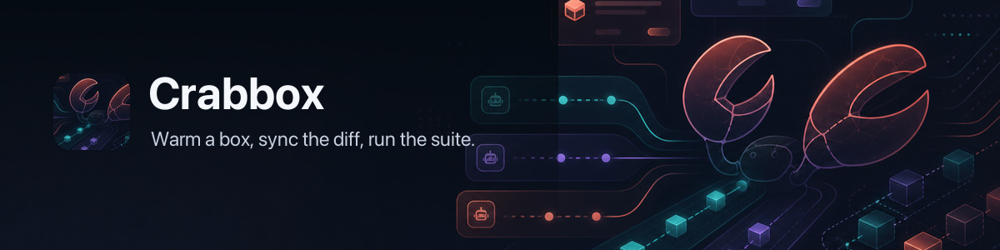

# 🦀 📦 Crabbox



[](https://github.com/openclaw/crabbox/actions/workflows/ci.yml)
[](https://github.com/openclaw/crabbox/actions/workflows/release-qualification.yml)
[](https://github.com/openclaw/crabbox/actions/workflows/release-assets.yml)
[](https://github.com/openclaw/crabbox/releases/latest)

**Warm a box, sync the diff, run the suite — with durable, cryptographically attributable execution evidence.**

Crabbox is a remote software testing and execution control plane for
maintainers, contributors, and automation that need to run repository commands
somewhere other than the laptop in front of them: managed cloud capacity, an
existing SSH host, or a delegated sandbox provider. It keeps the local
edit-save-run workflow and moves the expensive or evidence-producing work onto
a remote runner.

```sh
crabbox run -- pnpm test
```

Behind that one command, Crabbox leases or selects a runner, syncs the working
tree, runs the command remotely, streams output back, records evidence, and
releases the target. The system is a Go CLI on your machine, an optional
coordinator that owns provider credentials and lease state, and a managed or
delegated runner — plus **Crabedence**, a planner-agnostic execution kernel
whose **Effect Fabric** gives every mutating invocation a durable, crash-safe,
cryptographically provable outcome.

**Contents** — [Architecture](#architecture-at-a-glance) ·
[The Effect Fabric](#the-effect-fabric) ·
[Execution kernel](#execution-kernel) · [Install](#install) ·
[Quick start](#quick-start) · [Providers](#providers) ·
[Configuration](#configuration) · [Development](#development) ·
[Docs](#docs)

## Architecture at a glance

```text
your laptop                    coordinator runtime               cloud provider
-------------                  -------------------               --------------
crabbox CLI     -- HTTPS -->   Cloudflare + Durable Object   -->  Hetzner / AWS / Azure /
   |                         or Node.js + PostgreSQL              GCP / Daytona
   |                                                                   |
   +---------------- SSH + rsync to leased runner <-------------------+

ANY PLANNER (Hermes, OpenAI Agents SDK, LangGraph, custom)
      │  capability invocation ABI
      ▼  (capability, arguments, principal, grant_id, idempotency_key)
CRABEDENCE EXECUTION KERNEL  —  crabbox serve-execution (Unix socket)
      │
      ├─ capability registry        authoritative execution classes
      ├─ authority verification     immutable, digest-bound grants
      ├─ exact-number validation    arbitrary-precision schema checks
      ├─ EFFECT FABRIC              durable EffectStore — SQLite or PostgreSQL
      │     PREPARED → EXECUTING → IN_FLIGHT → COMMITTED | FAILED | UNKNOWN
      │     fenced leases · cluster-epoch DR fencing · recovery mode
      ├─ provider dispatch          detached post-dispatch durability
      ├─ forensic observation ledger  immutable provider records
      ├─ RunEvidenceV1 + Ed25519 TerminalRunReceiptV3 signing
      └─ reconciliation             UNKNOWN resolved by independent evidence
```

- **CLI** — Go binary. Loads config, mints a per-lease SSH key, asks the broker
  for a lease, waits for SSH, seeds remote Git, rsyncs the dirty checkout (with
  a fingerprint skip when nothing changed), runs the command, streams output,
  releases.
- **Coordinator** — the same fleet control plane on Cloudflare Workers plus a
  Fleet Durable Object, or Node.js plus PostgreSQL and pg-boss. Owns provider
  credentials, serializes lease state, enforces active-lease and monthly spend
  caps, and expires stale leases. Auth is GitHub browser login, a shared
  bearer token, or an explicitly trusted identity proxy.
- **Runner** — a throwaway machine reachable over SSH on the primary port
  (default `2222`) plus configured fallback ports, prepared with Crabbox's
  sync/run prerequisites. Linux uses Ubuntu with cloud-init and `/work/crabbox`;
  native Windows uses OpenSSH, Git for Windows, and `C:\crabbox`. No broker
  credentials live on the box. Project runtimes (Go, Node, Docker, services,
  secrets) come from your repo's GitHub Actions hydration, devcontainer, Nix,
  mise/asdf, or setup scripts — not from Crabbox.
- **Execution kernel** — a persistent Go service owning capability resolution,
  authority verification, durable idempotency, provider dispatch, evidence
  generation, receipt signing, and reconciliation. Planners connect over a
  length-prefixed JSON Unix-socket ABI; the kernel — never the planner —
  decides execution class, authority, and provider binding.

The normal CLI data plane — SSH, rsync, command execution — runs directly from
the CLI to the runner. A dedicated
[private AWS workspace service](docs/features/aws-private-workspaces.md) is a
separate SSM-only controller path for API-managed workspaces; it has no public
instance address or SSH access.

Only `aws`, `azure`, `daytona`, `gcp`, and `hetzner` can transfer provider
lifecycle to the coordinator, and even those run direct from the CLI when no
coordinator URL is configured. Every other provider runs direct or delegated.
A direct-provider mode (`--provider hetzner|aws|azure|daytona|gcp|digitalocean|linode|proxmox`
with local credentials) exists for debugging the coordinator itself or using
private infrastructure.

### Coordinator deployment choices

| Path                     | State and scheduling                                          | Best fit                                                                                                                    |
| ------------------------ | ------------------------------------------------------------- | --------------------------------------------------------------------------------------------------------------------------- |
| **Cloudflare Workers**   | Fleet Durable Object, alarms, scheduled Worker trigger        | Managed edge deployment with minimal server operations and optional Cloudflare Access.                                      |
| **Node.js + PostgreSQL** | PostgreSQL key/value state, pg-boss alarms and reconciliation | Initial runtime for containers, a VM, or Kubernetes with one replica; requires Node.js, PostgreSQL 13+, TLS, and WebSockets. |
| **No coordinator**       | Local claims and provider-owned state                         | Personal/direct providers where shared credentials, history, budgets, and central cleanup are unnecessary.                  |

Both coordinator runtimes expose the same API, GitHub login, portal, provider
adapters, cost controls, cleanup behavior, and live bridges. State is not
automatically migrated between Durable Object storage and PostgreSQL. See
[Infrastructure](docs/infrastructure.md) for deployment and ingress details.

## The Effect Fabric

The Effect Fabric is Crabedence's durable execution contract — a frozen state
machine, forensic evidence model, and fencing protocol implemented identically
by two storage engines: `SQLiteStore` (embedded WAL, `synchronous=FULL`, the
single-host default) and `Store` (PostgreSQL, for clustered deployments). A
shared conformance suite runs the same invariant checks against both engines —
an engine-specific regression is a contract violation regardless of which
backend exhibits it. The contract is pinned by
[ADR-002](docs/adr/ADR-002-durable-effect-r13-contract-freeze.md) and specified
in the [durable execution contract](docs/spec/durable-execution-contract.md).

```text
PREPARED ──▶ EXECUTING ──▶ IN_FLIGHT ──▶ COMMITTED | FAILED | UNKNOWN
    ▲            │                            │                     │
    └────────────┘ AbandonPreDispatch         │            reconciliation
         (dispatch boundary                   │            (independent
          not crossed)                        ▼            evidence only)
                                    external provider          ▼
                                    effect MAY have      COMMITTED | FAILED
                                    occurred
```

The frozen invariants:

- **`IN_FLIGHT` means the external effect may have occurred.** A crash after
  dispatch can never be resolved as "definitely didn't run" — the record
  becomes or stays `UNKNOWN`.
- **`UNKNOWN` can never automatically redispatch.** It is a first-class
  terminal-pending state resolved only by independent evidence — provider
  operation lookup, signed receipts — never by blind retry.
- **Caller cancellation cannot cancel mandatory post-dispatch persistence.**
  Detached durability work completes even when the invoking context dies.
- **Terminal states cannot regress.** `COMMITTED` and `FAILED` are immutable.
- **Provider observations are durable before classification and immutable
  forever.** The observation ledger preserves the provider's original result
  bytes and digests; terminal resolution never overwrites them. Conflicting
  observations on the same record are rejected with a typed
  `PROVIDER_OBSERVATION_CONFLICT`.
- **`CRITICAL COMMITTED` requires signed `COMPLETED` evidence; `CRITICAL
  FAILED` requires signed `NO_EFFECT` evidence.** Receipts are Ed25519-signed
  and verified against a trusted signer fingerprint ring; a resolver's own
  assertion is never evidence. One terminal policy covers both `Finalize` and
  `ResolveRecovery` — there is no weaker recovery path.
- **Authority is immutable and digest-bound.** Grant generations are strictly
  increasing under a serialized authority head; revocation and closure are
  durable and explicit, and every admitted execution records the generation
  and grant digest that permitted it.
- **Every mutation is fenced.** Lease token + generation + state/version CAS
  + cluster epoch — inside the mutation, on database-owned time.
- **Request identity is exact.** Canonical digests use normalized
  arbitrary-precision number representation and fail closed; schema
  validation never routes JSON numbers through `float64`, so
  `9007199254740993` is never silently rounded to `9007199254740992`.

### Disaster-recovery fencing

A persisted cluster epoch in `cluster_meta` fences stale executors after a
snapshot restore or environment rebuild. Stores capture their admitted epoch
at construction; every mutation requires it to still match, and stale writers
fail with the typed `CLUSTER_EPOCH_MISMATCH`. `AdvanceClusterEpoch` is a
compare-and-swap increment that also declares `RECOVERY_REQUIRED` — new-effect
admission stays closed (`CLUSTER_RECOVERY_REQUIRED`) while reads and
reconciliation of inherited `IN_FLIGHT`/`UNKNOWN` records remain open, until
`CompleteClusterRecovery` reopens admission. Reads are never fenced: a fenced
executor can still see the world it can no longer mutate.

### Signer policy and forensic evidence

CRITICAL evidence is signed by provisioned Ed25519 keys. Development mode may
auto-generate a signer; production mode (`CRABBOX_MODE=production`) and any
multi-replica deployment (`CRABBOX_REPLICAS > 1`) fail closed without an
externally provisioned key (`CRABBOX_EVIDENCE_KEY`), because each replica that
mints its own key silently creates an independent evidence identity. Signer
publication is crash-durable — atomic no-clobber write, file sync, directory
sync — and rotation keeps retired fingerprints in the trusted ring so
historical receipts remain verifiable.

### Observability

`StoreMetrics().Snapshot()` exports semantic counters — acquires, terminal
outcomes, UNKNOWN entries, lease renewals, fence rejections, lease losses,
observation writes and conflicts, reconcile claims/resolutions/suspensions,
CRITICAL evidence rejections, cluster-epoch and recovery-mode rejections.
`ReconciliationBacklog` returns the pending UNKNOWN count and oldest entry age
in one query — the top alert signal. The authority stores expose the same
contract: issuance, revocation, closure, resolve, and resolve-denial counters.
See the [operations spec](docs/spec/durable-execution-operations.md) for the
alert table and qualification tiers (`QUALIFIED_LOCAL` →
`QUALIFIED_SINGLE_NODE` → `QUALIFIED_POSTGRES` → `QUALIFIED_DISTRIBUTED`).

### Adversarial qualification

The contract is qualified, not just implemented: a deterministic crash-point
matrix SIGKILLs real executor and external-provider processes at every durable
boundary (post-acquire through post-recovery), asserts at-most-once external
effect and reconcilable UNKNOWN, runs 50-process PostgreSQL dispatch torture
(exactly one dispatch) and racing-reconciler claims (exactly one claim), and
verifies migration crash-consistency and WAL integrity on SQLite. Cross-language
conformance proves Go and TypeScript produce identical canonical evidence and
accept/reject identical receipt domains.

## Execution kernel

Crabedence is a planner-agnostic trusted execution kernel. Any
planning/reasoning runtime (Hermes, OpenAI Agents SDK, LangGraph, custom) can
invoke capabilities through a stable ABI. Crabedence independently resolves
execution class, authority, schema, and provider binding from its registry —
the planner does not supply security-relevant properties.

See
[Architecture: Planner-Agnostic Execution Kernel](docs/architecture/execution-kernel.md)
and [Capability Invocation ABI](docs/spec/capability-invocation-abi.md).

```text
capability invocation ABI
(capability, arguments, principal, grant_id, idempotency_key)
      │
      ├─ PURE → local execution (no socket hop)
      └─ READ / MUTATION / CRITICAL → Crabedence
```

Execution classes are immutable once registered — a CRITICAL capability cannot
be downgraded to READ at runtime. MUTATION and CRITICAL operations require
idempotency keys.

The `crabbox serve-execution` command starts the persistent Go execution
service on a Unix socket. This is the production architecture: a long-lived
Go process owns the capability registry, authority verification, durable
idempotency, provider dispatch, evidence generation, and V3 receipt signing.
NeMo connects to this service over the Unix socket — no per-call subprocess
spawn.

```sh
# Start the persistent execution service
crabbox serve-execution

# The service listens on a Unix socket (XDG_RUNTIME_DIR/crabedence/execution.sock)
# Any planner can connect and send capability invocations
# Durable idempotency defaults to an embedded SQLite store (WAL,
# synchronous=FULL) at ~/.config/crabbox/crabedence.db — no database
# daemon required. MUTATION/CRITICAL fail closed without durable storage.
# CRABEDENCE_STORE_BACKEND=sqlite|postgres|none selects the backend;
# CRABEDENCE_STORE_PATH overrides the SQLite file;
# CRABEDENCE_DATABASE_URL selects/configures PostgreSQL for
# multi-replica or clustered deployments.
```

The `crabbox exec` command is a stdin/stdout bridge for testing and ad-hoc
execution. It validates requests through the same capability registry but
cannot dispatch to providers — use `crabbox serve-execution` for real
execution.

```sh
# Validate a request (returns CAPABILITY_UNIMPLEMENTED for dispatch)
echo '{"capability":"system.echo","arguments":{},"authority":{"principal":"alice","grant_id":"g1"}}' | crabbox exec
```

Built-in capabilities:

- `system.echo` (PURE) — returns arguments as echo result
- `system.info` (READ) — returns system information (goes through remote port)
- `test.counter.increment` (MUTATION) — harmless mutation with idempotency

### NEMO

NEMO (`nemo/`) is an optional specialized reasoning/research component, not
the parent runtime. It provides a thin adapter to Crabedence's Unix socket and
a test client for the execution service. Any planner can replace NEMO — the
capability invocation ABI is the stable boundary.

See [Capability Invocation ABI](docs/spec/capability-invocation-abi.md),
[NEMO contracts](nemo/contracts/execution.ts),
[NEMO kernel](nemo/kernel/kernel.ts),
[Crabedence adapter](nemo/adapters/crabedence/adapter.ts),
[Go capability registry](internal/capability/registry.go),
[Go execution service](internal/execution/service.go), and
[Go idempotency store](internal/idempotency/store.go).

## Who Crabbox is for

Crabbox fits teams and tools that need repeatable remote execution without
turning every test run into a bespoke CI job:

- maintainers who need faster or larger machines for test suites, builds,
  browser checks, or platform-specific validation;
- contributors who want a disposable environment that matches a repository's
  setup scripts and can be released when the run finishes;
- AI agents and other automation that need command output, logs, artifacts,
  and run history from an auditable remote box — with cryptographically signed
  execution evidence and a typed execution boundary for reasoning systems;
- teams that want coordinator-owned cloud credentials, spend caps, cleanup,
  and shared usage history instead of local long-lived provider keys.

Use Crabbox when local compute is too slow, the target platform is somewhere
else, a workflow needs a clean disposable runner, or a reviewer needs streamed
evidence from the exact command that ran. Do not use it as a replacement for
CI, a hostile multi-tenant sandbox, a secrets scrubber, or an isolation
boundary between mutually untrusted users.

## Trust model

Crabbox is a developer execution tool, not a hostile multi-tenant platform or
a uniform security sandbox. It assumes the local OS user, repository
configuration, configured project tooling, and authenticated coordinator
operators are trusted. Repository configuration is executable project
automation: it can run local helpers, select runtimes, mount host resources,
and control development infrastructure. Review unfamiliar repositories before
running Crabbox.

The optional coordinator is intended for a cooperative trusted team. Its
authentication, ownership, and sharing controls prevent unauthorized access
and accidental cross-owner operations, but do not provide isolation between
mutually adversarial tenants. See the [Security Policy](SECURITY.md) for the
supported boundary and [Operational security](docs/security.md) for deployment
guidance.

Within that boundary, credentialed HTTP redirects are confined to their
configured origin, destructive provider recovery requires an exact local
claim or stronger provider-side ownership metadata, and artifact publication
accepts only regular files from the selected bundle. Provider diagnostics
redact configured credentials on the documented clients, but captured output
and failure bundles are not automatically scrubbed; review them before
sharing. See [Operational security](docs/security.md) and
[Artifacts](docs/features/artifacts.md).

## Install

Homebrew installs the complete release distribution:

```sh
brew install openclaw/tap/crabbox
crabbox --version
```

The [release archives](https://github.com/openclaw/crabbox/releases) are the
other complete distribution for macOS, Linux, and Windows. Go users can
instead compile and install only the CLI from an explicit release version
(supported starting with v0.44.0; do not use `@latest` while older releases
remain visible):

```sh
go install github.com/openclaw/crabbox/cmd/crabbox@v0.44.0
```

The module requires Go 1.26 and declares go1.26.5 as its preferred toolchain;
use Go 1.26.5 or newer, or leave Go's automatic toolchain selection enabled.
`go install` builds the Go CLI locally. It does not install release companion
executables or assets, especially `crabbox-apple-vm-helper`, and it is not the
signed/notarized prebuilt distribution. Use Homebrew or a release archive for
complete platform capabilities, notably the Apple VM provider on Apple
Silicon.

The native Windows CLI requires Windows 10 version 1709+ or Windows Server
2019+ for snapshot-preserving state replacement and cleanup. Supported WSL2
and x64 no-WSL Windows transfer selection requires a build from current
`main` or Crabbox v0.42.1 and newer. Follow the
[Windows installation guide](docs/windows-install.md) for the supported setup.

The Apple Silicon Homebrew install uses the release archive that also
contains the native `crabbox-apple-vm-helper` for the local Apple VM provider.

Laptop prerequisites: `git`, `ssh`, `ssh-keygen`, `rsync`, `curl`.

### Integrations

`crabbox init --detect` generates a repo-local Agent Skill for compatible
coding agents. The [Zed package](integrations/zed/README.md) adds checked
tasks and YAML support; a separate core command, `crabbox open --editor=zed`,
provides the Zed Remote Projects handoff. See the
[integration catalog](docs/integrations/README.md) for current support and
lifecycle boundaries.

Existing repositories that only need agent discovery can install the generic
Skill with GitHub CLI:

```sh
gh skill install openclaw/crabbox skills/crabbox \
  --pin refs/heads/main --agent codex --scope project
```

Or use the cross-client Skills CLI:

```sh
npx skills add https://github.com/openclaw/crabbox --skill crabbox
```

Crabbox also publishes a digest-verified discovery index from its own domain:

```sh
npx skills add https://crabbox.sh --skill crabbox
```

Cross-vendor discovery services can index the same Skill through Crabbox's
[draft-compatible AI Catalog](https://crabbox.sh/.well-known/ai-catalog.json).

Herdr users can add Crabbox lease controls and repository workflows to the
Herdr action palette:

```sh
herdr plugin install openclaw/crabbox/plugins/herdr
```

The plugin provides a live boxes overlay plus actions for `warmup`,
`prewarm`, `connect`, repository jobs, and `doctor`. See
[Crabbox for Herdr](plugins/herdr/README.md) for action details and optional
keybindings.

## Quick start

Broker access is deployment-specific. Use a coordinator URL from your team,
use direct-provider mode for a personal cloud account, or self-host the
broker on Cloudflare or Node.js/PostgreSQL with your own provider credentials
and spend caps. See
[Getting started](docs/getting-started.md#choosing-an-access-path) and
[Infrastructure](docs/infrastructure.md#self-hosted-broker-minimum-setup) for
the setup paths.

```sh
# log in once per machine (stores a broker token in user config)
crabbox login --url https://broker.example.com

# verify local prerequisites and broker reachability
crabbox doctor

# one-shot: lease, sync, run, release
crabbox run -- pnpm test

# named repo workflow from .crabbox.yaml
crabbox job run full-ci

# or warm a box once, then reuse it
crabbox warmup                                       # prints cbx_... + a slug
crabbox prewarm                                      # lease + Actions hydration
crabbox run --id blue-lobster -- pnpm test:changed
crabbox connect blue-lobster                         # open an interactive SSH session
crabbox ssh --id blue-lobster
crabbox open --editor=zed --id blue-lobster          # prepare a Zed Remote Projects session
crabbox stop blue-lobster
```

Every lease has a stable `cbx_...` ID and a friendly crustacean slug
(`blue-lobster`, `swift-hermit`, …). Either works wherever an `--id` is
accepted. Use `--slug <name>` on fresh leases when a specific reusable slug
helps, and `--label <text>` on `run` when the history entry needs a
human-readable name.

## Providers

`Brokered` providers can run through either coordinator runtime (or direct
when no coordinator is configured); every other provider runs direct or
delegated from the CLI.

<details>
<summary><strong>SSH-lease providers</strong> — provision or connect a box, full lifecycle (27 providers)</summary>

| Provider and aliases | Runs on / mode | Notes |
| --- | --- | --- |
| [AWS EC2](docs/providers/aws.md) — `aws` | Linux, macOS, Windows · brokered | EC2 instances and EC2 Mac; native AMI/EBS checkpoints; optional dedicated SSM-only private workspace service. |
| [Azure](docs/providers/azure.md) — `azure` | Linux, Windows · brokered | VMs with Tailscale support; native Windows and WSL2. |
| [Google Cloud](docs/providers/gcp.md) — `gcp` (`google`, `google-cloud`) | Linux · brokered | Compute Engine VMs with Tailscale support. |
| [Hetzner Cloud](docs/providers/hetzner.md) — `hetzner` | Linux · brokered | VMs with desktop/browser/code and Tailscale. |
| [DigitalOcean](docs/providers/digitalocean.md) — `digitalocean` | Linux · direct | Droplets with per-lease SSH keys and Crabbox tags. |
| [Linode](docs/providers/linode.md) — `linode` | Linux · direct | Linode instances with metadata user-data, optional existing firewall attachment, and Crabbox tags. |
| [Hostinger](docs/providers/hostinger.md) — `hostinger` | Linux · direct | VPS leases over public SSH; explicit purchase opt-in, stop-only release. |
| [Parallels](docs/providers/parallels.md) — `parallels` | Linux, macOS, Windows · direct | Local or remote macOS host; checkpoint/fork/restore/snapshot. |
| [Proxmox](docs/providers/proxmox.md) — `proxmox` | Linux · direct | Clone QEMU templates on a private Proxmox VE cluster. |
| [XCP-ng](docs/providers/xcp-ng.md) — `xcp-ng` | Linux · direct | Self-hosted XCP-ng pool on dedicated x86_64 server hardware. |
| [Incus](docs/providers/incus.md) — `incus` | Linux · direct | Idempotent SSH leases and private container disk checkpoints through the official Incus Go client. |
| [Firecracker](docs/providers/firecracker.md) — `firecracker` | Linux · direct | Self-hosted Firecracker microVM leases on a Linux KVM host with prepared kernel, rootfs, and CNI. |
| [Static SSH](docs/providers/ssh.md) — `ssh` (`static`, `static-ssh`) | Linux, macOS, Windows · direct | Existing machines; no provisioning. |
| [Local Container](docs/providers/local-container.md) — `local-container` (`docker`, `container`, `local-docker`) | Linux · direct | Local Docker-compatible runtime (Docker Desktop, OrbStack, Colima, Podman). |
| [Apple Container](docs/providers/apple-container.md) — `apple-container` (`apple`, `applecontainer`) | Linux · direct | Apple's native `container` runtime on Apple silicon macOS. |
| [Apple Container Machine](docs/providers/apple-machine.md) — `apple-machine` (`applemachine`) | Linux · direct | Persistent Linux development machines from Apple Container 1.0, defaulting to Alpine. |
| [Apple VZ](docs/providers/apple-vm.md) — `apple-vm` (`applevm`) | Linux ARM64 · direct | Full Ubuntu VMs through Apple `Virtualization.framework`; no cloud account or VM daemon. |
| [exe.dev](docs/providers/exe-dev.md) — `exe-dev` (`exe`, `exedev`) | Linux · direct | exe.dev VMs exposed as public SSH leases. |
| [KubeVirt](docs/providers/kubevirt.md) — `kubevirt` (`kubernetes-vm`) | Linux · direct | Generic KubeVirt VMs through `kubectl`, `virtctl`, and control-plane SSH forwarding. |
| [External](docs/providers/external.md) — `external` (`exec-provider`) | Linux · direct | Configured executable implementing the Crabbox provider protocol. |
| [Namespace Devbox](docs/providers/namespace-devbox.md) — `namespace-devbox` (`namespace`, `namespace-devboxes`) | Linux · direct | Namespace.so Devboxes over SSH. |
| [Namespace Compute Instance](docs/providers/namespace-instance.md) — `namespace-instance` (`namespace-compute`) | Linux · direct | Namespace Compute instances through `nsc` and SSH. |
| [Semaphore](docs/providers/semaphore.md) — `semaphore` (`sem`) | Linux · direct | A Semaphore CI job leased as a testbox. |
| [Sprites](docs/providers/sprites.md) — `sprites` | Linux · direct | Sprites microVMs through `sprite proxy`. |
| [Tenki](docs/providers/tenki.md) — `tenki` | Linux · direct | Tenki sandbox VMs through `tenki sandbox ssh-proxy`. |
| [Coder](docs/providers/coder.md) — `coder` | Linux · direct | Coder workspaces through `coder ssh --stdio`; stops by default, deletes only by opt-in. |
| [Daytona](docs/providers/daytona.md) — `daytona` | Linux · direct | Daytona-managed dev sandbox over SSH. |
| [Morph](docs/providers/morph.md) — `morph` | Linux · direct | Morph Cloud snapshot-backed instances over the shared SSH gateway. |
| [RunPod](docs/providers/runpod.md) — `runpod` (`run-pod`, `runpodio`) | Linux · direct | RunPod GPU pods with public SSH. |
| [ASCII Box](docs/providers/ascii-box.md) — `ascii-box` (`ascii`, `asciibox`) | Linux · direct | ASCII Box Ubuntu sandboxes exposed as SSH leases. |

XCP-ng itself can host Linux, Windows, and BSD guests, but Crabbox's current
`xcp-ng` adapter provisions normal leases from Linux templates only. The
separate XCP-ng ISO E2E harness also covers Windows x86_64/x64 installers.
macOS guests are out of scope on this path; use the Tart provider on Apple
hardware for macOS VM workflows.

</details>

<details>
<summary><strong>Delegated-run providers</strong> — sandbox/proof runners, no SSH lease (20 providers)</summary>

| Provider and aliases | Runs on | Notes |
| --- | --- | --- |
| [AWS Lambda MicroVM](docs/providers/aws-lambda-microvm.md) — `aws-lambda-microvm` | Linux ARM64 | Lambda Firecracker MicroVM with archive sync, retained reuse, and pause/resume. |
| [Cloudflare](docs/providers/cloudflare.md) — `cloudflare` (`cf`) | Linux | Cloudflare Containers via the Worker runtime. |
| [Cloud Run Sandbox](docs/providers/cloud-run-sandbox.md) — `cloud-run-sandbox` (`gcrun-sandbox`, `cloudrun-sandbox`) | Linux | Google Cloud Run sandboxes via gateway or in-container `sandbox` CLI. |
| [Docker Sandbox](docs/providers/docker-sandbox.md) — `docker-sandbox` | Linux | Docker Sandboxes through the standalone `sbx` CLI. |
| [E2B](docs/providers/e2b.md) — `e2b` | Linux | E2B Firecracker sandbox. |
| [Freestyle](docs/providers/freestyle.md) — `freestyle` | Linux | Freestyle VMs through the Freestyle REST API. |
| [Islo](docs/providers/islo.md) — `islo` | Linux | Islo sandbox. |
| [Modal](docs/providers/modal.md) — `modal` | Linux | Modal Sandbox through the local Python client. |
| [Microsoft Execution Containers](docs/providers/mxc.md) — `mxc` (`execution-container`) | Windows | Policy-driven local Windows process containment. |
| [OpenComputer](docs/providers/opencomputer.md) — `opencomputer` (`oc`, `open-computer`) | Linux | OpenComputer Linux VMs through the OpenComputer REST API. |
| [OpenSandbox](docs/providers/opensandbox.md) — `opensandbox` | Linux | OpenSandbox delegated containers through the OpenSandbox Go SDK. |
| [Railway](docs/providers/railway.md) — `railway` (`rail`, `railwayapp`) | Linux | Inspect and stop an existing Railway service. |
| [Anthropic Sandbox Runtime](docs/providers/anthropic-sandbox-runtime.md) — `anthropic-sandbox-runtime` (`srt`) | macOS, Linux | Local one-shot sandboxing through Anthropic's `srt` CLI. |
| [SmolVM](docs/providers/smolvm.md) — `smolvm` (`smol`, `smolmachines`, `smolfleet`) | Linux | Smol Machines microVM sandboxes via the smolfleet API. |
| [Tensorlake](docs/providers/tensorlake.md) — `tensorlake` (`tl`, `tensorlake-sbx`) | Linux | Tensorlake Firecracker sandbox via the Tensorlake CLI. |
| [Upstash Box](docs/providers/upstash-box.md) — `upstash-box` (`upstash`, `box`, `upstashbox`) | Linux | Upstash Box through the Box REST API. |
| [Azure Dynamic Sessions](docs/providers/azure-dynamic-sessions.md) — `azure-dynamic-sessions` | Linux | Azure Container Apps dynamic sessions. |
| [Blacksmith Testbox](docs/providers/blacksmith-testbox.md) — `blacksmith-testbox` (`blacksmith`) | Linux | Delegated Blacksmith CI Testbox lifecycle and execution. |
| [W&B Sandboxes](docs/providers/wandb.md) — `wandb` (`weights-and-biases`) | Linux | Weights & Biases Sandboxes; reuses `wandb login` credentials. |
| [Windows Sandbox](docs/providers/windows-sandbox.md) — `windows-sandbox` (`wsb`, `windows-sandbox-provider`) | Windows | Disposable Microsoft Windows Sandbox sessions through generated `.wsb` configs. |

</details>

See [Providers](docs/providers/README.md) for the full reference,
capabilities, and authoring guide.

## Highlights

- **One-shot or warm workspaces.** `crabbox run` for fire-and-forget;
  `crabbox warmup` + `--id` for reusable named leases.
- **Dirty-tree sync.** rsync of the working checkout; fingerprint short-circuit
  when nothing changed; `--full-resync` for stale boxes.
- **Durable execution fabric.** Frozen PREPARED→EXECUTING→IN_FLIGHT state
  machine, fenced leases, first-class UNKNOWN reconciliation, cluster-epoch DR
  fencing, and an immutable forensic observation ledger — identical on SQLite
  and PostgreSQL.
- **Signed evidence.** `RunEvidenceV1` digests bound into Ed25519
  `TerminalRunReceiptV3`; production deployments require provisioned signer
  keys, and rotation preserves historical verification.
- **Jobs and capsule packaging.** Named workflows in `.crabbox.yaml`,
  capsule/capsule-digest reproducibility, remote-digest pinning.
- **Cost and capacity controls.** Spend caps, active-lease limits, spot market
  strategy and fallback, idle/TTL expiry.
- **Fleet portal and live bridges.** Web portal, WebVNC/desktop bridges,
  Tailscale tailnet attachment, interactive SSH.
- **Windows, macOS, and Linux runners.** Native Windows via OpenSSH or WSL2,
  EC2 Mac, Parallels/Tart/Apple VZ on macOS.
- **Provider breadth.** 27 SSH-lease providers and 20 delegated sandbox
  providers behind one CLI and one coordinator API.

## Server classes

Most providers accept a size class (`tiny`, `small`, `standard`, `fast`,
`large`, `beast`) that maps to provider-specific instance types. Override with
`--type` or `CRABBOX_SERVER_TYPE` for a specific instance. Use `--arch arm64`
/ `architecture: arm64` for Linux ARM capacity on Azure or AWS. The dedicated
private AWS workspace API accepts only its server-configured instance
allowlist.

<details>
<summary><strong>Class → instance type mapping</strong> (per provider)</summary>

```text
AWS        tiny      t3a.micro / t4g.micro (with --arch arm64)
           small     t3a.small / t4g.small
           standard  t3a.large / t4g.large
           fast      c6i.xlarge / c7g.xlarge
           large     c6i.2xlarge / c7g.2xlarge
           beast     c6i.4xlarge / c7g.4xlarge

Azure      tiny      Standard_B2s_v2 …
           small     Standard_D4ads_v6 …
           standard  Standard_D2ads_v6 …
           fast      Standard_D4ads_v6 …
           large     Standard_D8ads_v6 …
           beast     Standard_D16ads_v6 …

Namespace  tiny..large   S
           beast         XL

Namespace Compute    tiny 1x2 · small 2x4 · standard 4x8 · fast 8x16 · large 16x32 · beast 32x64

Cloudflare all classes → standard-4 (lite, basic, standard-1..4 accepted as explicit --type)
```

</details>

## Configuration

Config resolves in order: flags → env → repo `.crabbox.yaml` → user
`~/.config/crabbox/config.yaml` → defaults.

```yaml
broker:
  url: https://broker.example.com
  provider: aws
  token: ...
class: beast
capacity:
  market: spot
  strategy: most-available
  fallback: on-demand-after-120s
  hints: true
aws:
  region: eu-west-1
  rootGB: 400
lease:
  idleTimeout: 30m
  ttl: 90m
ssh:
  key: ~/.ssh/id_ed25519
  user: crabbox
  port: "2222"
  # Ordered fallback ports tried after ssh.port; use [] to disable fallback.
  fallbackPorts:
    - "22"
```

Set `broker.mode: registered` to keep provisioning and cleanup in any direct
provider while registering lease metadata with the coordinator for inventory,
sharing, and portal WebVNC. Kept desktop leases start the outbound WebVNC
bridge automatically by default; set `broker.autoWebVNC: false` to opt out.
The coordinator never receives provider credentials or directly calls a
registered provider. By default it removes only registration metadata; an
explicitly bound outbound runtime adapter can perform a user-confirmed
workspace delete. API clients request the same generation-fenced delete with
`POST /v1/leases/{id}/release` and body `{"delete":true}`.

Forwarded environment is intentionally narrow: `NODE_OPTIONS` and `CI`. Do
not pass secrets as command-line arguments. For live-secret smoke tests, use
`crabbox run --env-from-profile <file> --allow-env NAME` so Crabbox forwards
only selected names and prints redacted presence/length metadata. For stale
warm boxes, `--full-resync` (alias `--fresh-sync`) resets the remote workdir
before syncing. For larger commands, use `--script <file>` or
`--script-stdin` so the remote runner executes an uploaded file instead of a
giant quoted shell string.

For binary or terminal-hostile output, use `crabbox run --capture-stdout
<path>` or `--capture-stderr <path>`. Add `--preflight` for a remote
capability snapshot, `--keep-on-failure` to SSH into the exact failed
one-shot lease, or `--download remote=local` to copy a successful-run
artifact back. Failed SSH-backed and Blacksmith delegated runs save local
`.crabbox/captures/*.tar.gz` bundles by default, falling back to the Crabbox
user state directory when the project destination is unwritable. The reported
`failure-bundle local=...` path identifies the saved bundle; see
[local capture storage](docs/observability.md#capturing-run-output-locally).
Captured files are not redacted by Crabbox.

Optional Tailscale reachability for managed Linux leases:

```yaml
tailscale:
  enabled: true
  network: auto
  tags:
    - tag:crabbox
  hostnameTemplate: crabbox-{slug}
  authKeyEnv: CRABBOX_TAILSCALE_AUTH_KEY
  exitNode: mac-studio.example.ts.net
  exitNodeAllowLanAccess: true
```

Tailscale is a network plane, not a provider. `--tailscale` joins new managed
Linux leases to the tailnet; `--network auto|tailscale|public` chooses how
SSH and VNC tunnel commands resolve the host. Brokered mode uses Worker OAuth
secrets to mint one-off keys; direct-provider mode reads the auth key from
the configured env var. See [Tailscale](docs/features/tailscale.md).

<details>
<summary><strong>Provider-specific config snippets</strong></summary>

```yaml
# Static macOS or Windows target (existing machine, no provisioning)
provider: ssh
target: windows
windows:
  mode: normal # or wsl2
static:
  host: win-dev.local
  user: alice
  port: "22"
  workRoot: C:\crabbox
```

```yaml
# Local container (alias: docker; detects docker or podman)
provider: local-container
localContainer:
  runtime: docker
  image: debian:bookworm
  workRoot: /work/crabbox
```

```yaml
# Delegated Blacksmith CI Testbox
provider: blacksmith-testbox
blacksmith:
  org: example-org
  workflow: .github/workflows/ci-check-testbox.yml
  job: test
  ref: main
  idleTimeout: 90m
```

</details>

Keep provider tokens in environment variables, not repo config (for example
`CRABBOX_SEMAPHORE_TOKEN`, `CRABBOX_SPRITES_TOKEN`, `RUNPOD_API_KEY`,
`MORPH_API_KEY`, `ASCII_BOX_API_KEY`, `E2B_API_KEY`, `DAYTONA_API_KEY`,
`CLOUD_RUN_SANDBOX_URL`/`CLOUD_RUN_SANDBOX_SECRET`). The full env-var
reference, per-provider sections, and per-command flags are in
[docs/cli.md](docs/cli.md),
[Configuration](docs/features/configuration.md), and the
[provider docs](docs/providers/README.md).

## Development

```sh
# Go CLI
go build -trimpath -o bin/crabbox ./cmd/crabbox
go vet ./...
go test -race -timeout=20m ./...

# Coordinator runtimes (Node 22+ locally; CI runs Node 24)
npm ci --prefix worker
npm test --prefix worker
npm run build --prefix worker
npm run check:node --prefix worker
npm run build:node --prefix worker

# NeMo execution kernel
npm ci --prefix nemo
npm run check --prefix nemo
npm test --prefix nemo

# Repository scripts
node scripts/generate-linux-readness.mjs --check
node scripts/generate-bootstrap.mjs --check
node --test scripts/*.test.js scripts/*.test.mjs

# Docs
scripts/check-docs.sh

# Live PostgreSQL suites (ephemeral postgres:16 or local initdb)
scripts/test-live-postgres.sh

# Release qualification (requires clean Git tree)
scripts/generate-release-evidence.sh
scripts/check-release-admission.sh
scripts/verify-release-artifact.sh

# Optional live smoke, when broker/provider credentials are available
CRABBOX_LIVE=1 CRABBOX_LIVE_REPO=/path/to/my-app scripts/live-smoke.sh

# Firecracker host readiness smoke (read-only; reports environment_blocked when Linux/KVM assets are missing)
CRABBOX_BIN=./bin/crabbox scripts/live-firecracker-smoke.sh
```

CI runs the full gate (gofmt, vet, race tests, all Go modules, coverage
threshold, repository script tests, docs link/build check, GoReleaser
snapshot, Worker lint/typecheck/tests/build, and NeMo typecheck/tests) on
every push and PR. The required `Go` check aggregates three independent
30-minute jobs: `Go test` (formatting, vet, deadcode, full race suite, Linux
supervision proof, and build), `Go modules` (normal tests in every module,
including the root), and `Go coverage` (90% core coverage threshold). The
race suite, all-module normal tests, and coverage collection use a 15-minute
package timeout. Use the explicit timeout locally too: the CLI race suite can
exceed Go's default 10-minute package deadline even when its individual tests
pass.

Production releases use a serialized, draft-first process: preserve and
verify the signed tag, build and Developer ID sign/notarize the macOS
candidates locally, verify the exact draft on native Apple Silicon and Intel
runners from protected-default code, then publish those exact artifacts,
dispatch the ordinary Homebrew tap update, and run independent
public-download, public Go installation, and native Homebrew smokes. See
[Release engineering](docs/RELEASING.md).

Release candidates use a machine-verifiable qualification pipeline:
`scripts/generate-release-evidence.sh` requires a clean Git working tree,
records commit/tree SHA, generates Git blob and raw SHA-256 source manifests,
runs all gates with uncached Go tests, captures race evidence, live
PostgreSQL fencing/parity plus the SQLite conformance leg, Worker
typecheck/lint/tests/build, cross-language conformance, and NeMo
typecheck/tests, then produces `qualification.json` with per-gate status.
`scripts/check-release-admission.sh` fails closed if any gate is not PASS.
`scripts/verify-release-artifact.sh` verifies SHA256SUMS, source manifest
equality (no extra files), per-gate PASS, commit/tree consistency, and
required evidence logs. The RC workflow builds the artifact from the exact
qualified commit, generates provenance via GitHub SLSA attestation, and
publishes as a GitHub prerelease. See
[VERIFY-RELEASE.md](VERIFY-RELEASE.md) for consumer verification
instructions.

Git-overlay integration tests use real Git with task-owned local and loopback
origins. Their local SSH stand-ins isolate Git authentication settings and
disable interactive credential requests, including during ordinary seed
fallback. A credential-helper/askpass canary guards this test-only boundary;
the separate production overlay security tests still inject hostile Git
config.

Cloudflare, Node/PostgreSQL, container, ingress, secrets, and DNS deployment
live in [docs/infrastructure.md](docs/infrastructure.md). The dedicated ECS
Fargate path is documented in
[Private AWS Workspaces](docs/features/aws-private-workspaces.md).

## Docs

- **Get the model:** [How Crabbox Works](docs/how-it-works.md), [Architecture](docs/architecture.md), [Concepts](docs/concepts.md), [Orchestrator](docs/orchestrator.md)
- **Use the CLI:** [CLI](docs/cli.md), [Commands](docs/commands/README.md), [Features](docs/features/README.md), [Configuration](docs/features/configuration.md)
- **Effect Fabric:** [Durable execution contract](docs/spec/durable-execution-contract.md), [Operations & qualification](docs/spec/durable-execution-operations.md), [ADR-001 contract freeze](docs/adr/ADR-001-durable-effect-contract-frozen.md), [ADR-002 r13 freeze](docs/adr/ADR-002-durable-effect-r13-contract-freeze.md)
- **Execution evidence:** [Run evidence spec](docs/spec/run-evidence.md), [Receipts](docs/commands/receipt.md), [Hermetic agent evidence](docs/features/hermetic-agent-evidence.md), [Portable coordinator](docs/features/portable-coordinator.md)
- **NeMo execution kernel:** [Contracts](nemo/contracts/execution.ts), [Kernel](nemo/kernel/kernel.ts), [Crabedence adapter](nemo/adapters/crabedence/adapter.ts), [Bridge](nemo/adapters/crabedence/bridge.ts)
- **Integrate editors and agents:** [Integrations](docs/integrations/README.md), [Editors](docs/integrations/editors.md), [AI agents and harnesses](docs/integrations/agents.md)
- **Choose a provider:** [Providers](docs/providers/README.md), [AWS](docs/providers/aws.md), [Azure](docs/providers/azure.md), [GCP](docs/providers/gcp.md), [Hetzner](docs/providers/hetzner.md), [DigitalOcean](docs/providers/digitalocean.md), [Linode](docs/providers/linode.md), [Hostinger](docs/providers/hostinger.md)
- **Advanced features:** [Actions hydration](docs/features/actions-hydration.md), [Capsules](docs/features/capsules.md), [Checkpoints](docs/features/checkpoints.md), [Jobs](docs/features/jobs.md), [Pond](docs/features/pond.md)
- **Interactive QA:** [Interactive Desktop and VNC](docs/features/interactive-desktop-vnc.md), [Artifacts](docs/features/artifacts.md), [Portal](docs/features/portal.md)
- **Integrate infrastructure:** [Bring Your Own Infrastructure](docs/features/bring-your-own-infrastructure.md), [Portable Coordinator](docs/features/portable-coordinator.md), [Private AWS Workspaces](docs/features/aws-private-workspaces.md), [External Provider](docs/providers/external.md)
- **Release engineering:** [Release qualification](.github/workflows/release-qualification.yml), [Release RC](.github/workflows/release-rc.yml), [VERIFY-RELEASE.md](VERIFY-RELEASE.md), [Release engineering](docs/RELEASING.md)
- **Operate it:** [Operations](docs/operations.md), [Observability](docs/observability.md), [Troubleshooting](docs/troubleshooting.md), [Performance](docs/performance.md)
- **Set it up or audit it:** [Infrastructure](docs/infrastructure.md), [Security Policy](SECURITY.md), [Operational Security](docs/security.md), [Getting Started](docs/getting-started.md), [Source Map](docs/source-map.md)
- **Changes:** [CHANGELOG.md](CHANGELOG.md)

The documentation site at <https://crabbox.sh/> is generated from the `docs/`
Markdown:

```sh
scripts/check-docs.sh
open dist/docs-site/index.html
```

## License

MIT — see [LICENSE](LICENSE).
